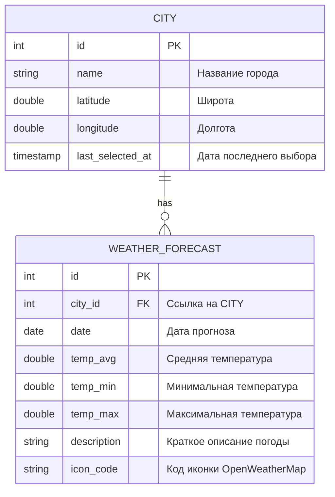

# ☀️ Приложение "Погода" (Weather App)

## 💡 Описание функциональности

Данное клиентское приложение, разработанное на **JavaFX**, предназначено для получения и отображения актуального прогноза погоды для выбранного города, используя API сервиса **OpenWeatherMap**.

### Ключевые возможности:

1.  **Поиск города:** Удобная строка поиска с функцией автодополнения (подсказки до 5 вариантов).
2.  **Сохранение данных:** Выбранный город сохраняется в локальной базе данных, чтобы при следующем запуске автоматически отображался его прогноз.
3.  **Текущий прогноз:** Отображение полной информации о погоде: температура (текущая и ощущаемая), min/max температура, влажность, давление, скорость и направление ветра, облачность, осадки, а также соответствующая иконка.
4.  **Прогноз на 4 дня:** Краткий прогноз на 4 последующих дня.
5.  **Обработка ошибок:** Уведомление пользователя через `MessageBox` в случае, если город не найден.
6.  **Логирование:** Использование `slf4j` и `logback` для логирования действий пользователя (в консоль) и ошибок (в файл).
7.  **Кастомные исключения:** Использование собственных классов исключений для более чистой и структурированной обработки ошибок.

***

## 📋 Вариант задания

Проект выполняется в рамках **Варианта 2: Приложение "Погода"**.

***

## 👨‍💻 Команда

| Роль | Фамилия | Имя | Username |
| :--- | :--- | :--- | :--- |
| Разработчик | Улискин | Даниил | tr1zet |
| Разработчик | Чистюхин | Антон | cherep121 |

***

## 📊 ER-диаграмма (Mermaid)

